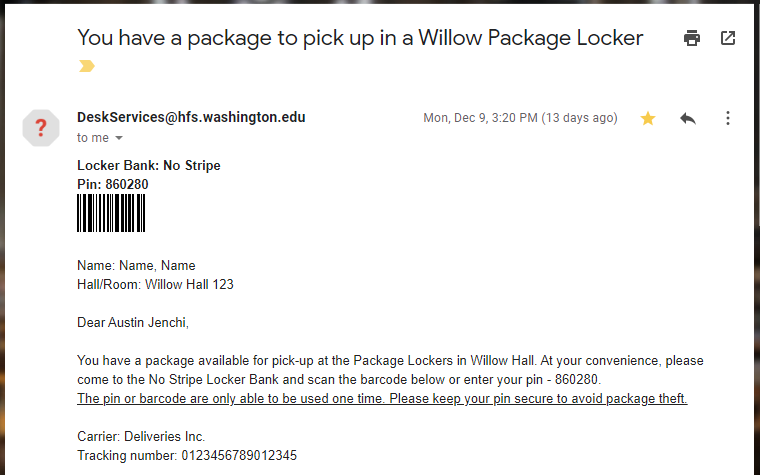
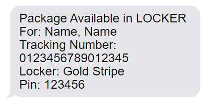
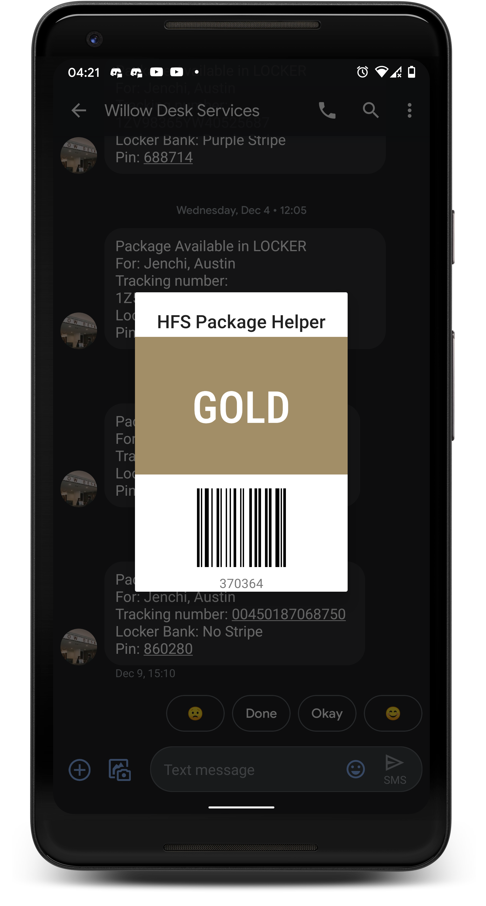

# HFS Package Helper

[UW's Housing & Food Services](https://hfs.uw.edu) sends notifications when packages arrive to their
Package Locker system. From there packages can be picked up using a handy barcode. These barcodes
are easily found in the email notifications, but the emails can sometimes be unreliable or lost in
spam filters. Text messages are much more reliable, but don't contain useful information like the
barcode or an easy way to identify the color of the locker.

This app parses those text messages and pulls the relevant information. It generates a useful barcode
to scan, as well as a small visual to identify the correct locker. Notifications can be shared easily
from a text into the app.

